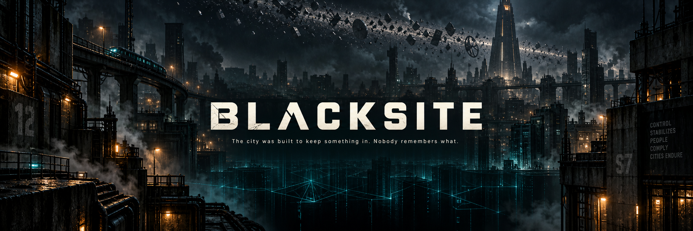

# Blacksite

*The city was built to keep something in. Nobody remembers what.*

Blacksite is a real-time multiplayer door game for
[NetBBS](https://github.com/Thiesi/NetBBS): a cyberpunk city called Karst,
sealed off from the world for forty-one years under a sky full of
orbital wreckage, with a network underneath it that has been very
patiently running the numbers. Players are Wakes, freshly decanted
clones with no memories, and the game is about what they become and how
far down they are willing to go.

It is played in a terminal, over Telnet, SSH, or NetBBS's web client,
at 80×24 or larger, in colour. Several callers on the same node share
one persistent world in real time: they see each other move, fight, and
talk; they run the city's network (the Lattice) while crewmates guard
their bodies; they capture relays for their factions; and once a season
they go down into the Blacksite together.

## Status

**Design complete, implementation not started.** This repository
currently holds the world bible, the game design, the technical
architecture, the asset manifest, and a build plan broken into slices
that are filed as issues. See `docs/plan/00-roadmap.md` for the plan and
the [issues](../../issues) for what is being worked on.

Blacksite is developed as a third-party native door: it has no commit
access to NetBBS. What it needs from the platform is written up in
`docs/upstream/` and filed in the NetBBS repository.

## Read this first

- Players and the curious: `docs/world/00-bible.md`.
- Developers and agents: `AGENTS.md`, then `docs/design/02-architecture.md`.
- SysOps: the operator guide arrives with the first release.

## How it will run

One long-lived game service per NetBBS node owns the world (an asyncio
simulation with a SQLite database in the door's install directory). Each
caller's NetBBS door session runs a thin client that connects to that
service over a local socket, sends keys, and renders what the server
tells it to. Nothing leaves the machine.

## License

BSD-2-Clause. See `LICENSE`.
